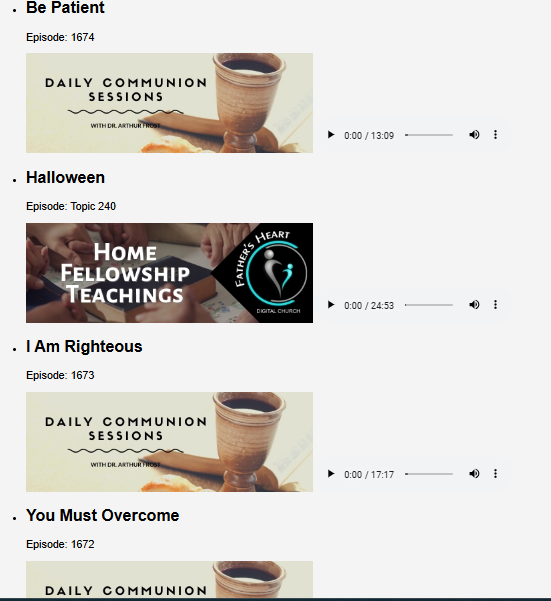

# Sermon Streamer

## Description
Sermon Streamer is a single-page React application that retrieves and displays sermon content from a JSON API. The project showcases how to work with React for fetching data and rendering it in a user-friendly interface, allowing users to easily access audio sermons along with relevant images and titles.


## Technologies Used
- React
- Axios (for making API calls)

## Installation
1. Clone the repository:
   ```bash
   git clone https://github.com/lihle-sibiya/TimelineApp.git
   cd TimelineApp

## Install dependencies:
   npm install

## Running the Application
To start the application, run: npm start

## API Integration
This app fetches data from the following API:[JSON API] (https://arthurfrost.qflo.co.za/php/getTimeline.php)


## Future Enhancements
In future versions, this project could be expanded by integrating a backend using Node.js and MongoDB for additional data management. This would involve:

- Setting up an Express server to handle API requests.
- Using MongoDB to store additional user-generated data or records.
-  Enhancing the frontend to interact with this backend for CRUD operations.

## Screenshots


## Author
Thembelihle Sibiya

